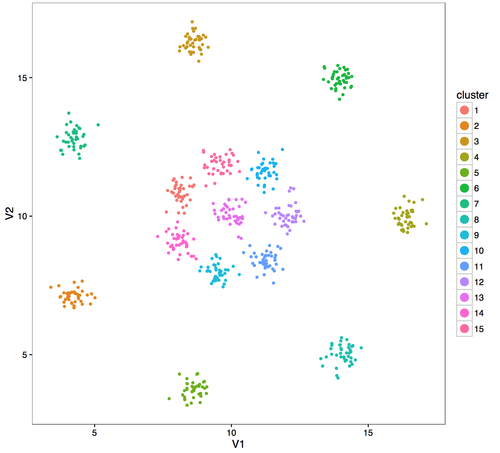
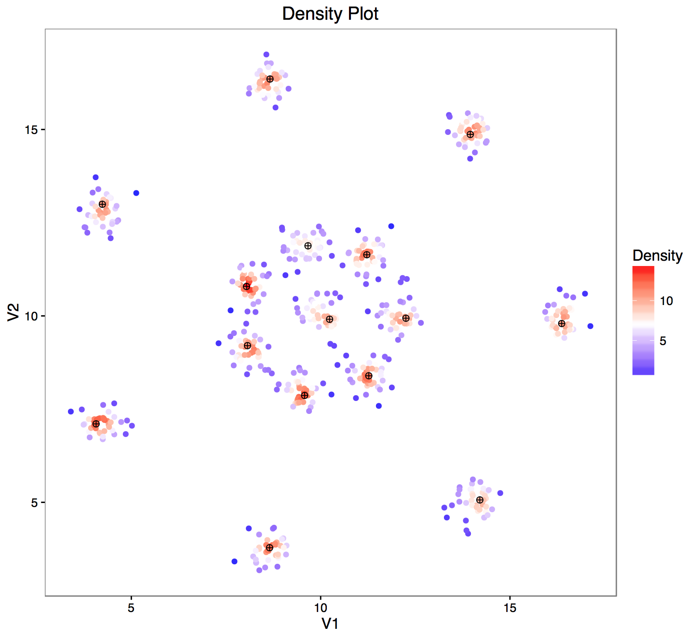
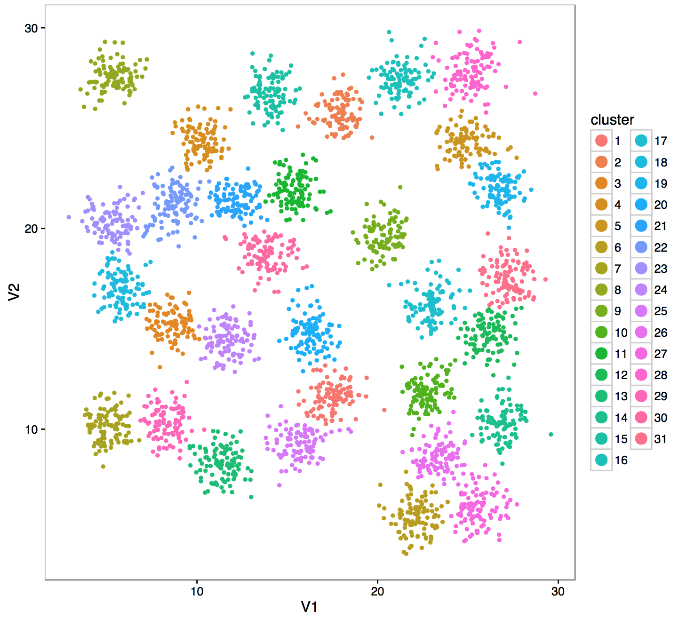
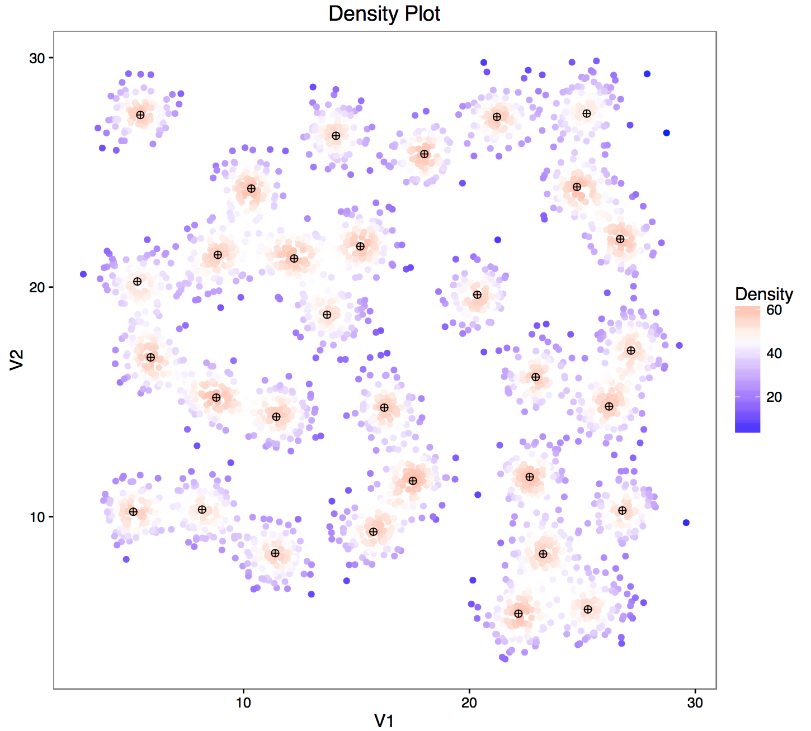

Fast clustering by automaticly search and find of density peaks
===============

### ClusterX

This package implement the clustering algorithm described by Alex Rodriguez and Alessandro Laio (2014) [1] with improvements of automatic peak detection and parallel computing.


### Installation

To install the latest version from the github repository, use:

``` r
if(!require(devtools)) 
install.packages("devtools") # If not already installed
devtools::install_github("JinmiaoChenLab/ClusterX")
```


### Usage

After installing the package, use the following code to run a simple example (to install, see below).

``` r
dir <- system.file("extdata", package = "ClusterX")
r15 <- read.table(paste(dir, "R15.txt", sep = .Platform$file.sep), header = FALSE)
r15_c <- ClusterX(r15[,c(1,2)])
clusterPlot(r15_c)
peakPlot(r15_c)
```






``` r
d31 <- read.table(paste(dir, "D31.txt", sep = .Platform$file.sep), header = FALSE)
d31_c <- ClusterX(d31[,c(1,2)])
clusterPlot(d31_c)
densityPlot(d31_c)
peakPlot(d31_c)
```






### Reference

[1] Rodriguez A, Laio A. Clustering by fast search and find of density peaks. Science. 2014;344: 1492–6. doi:10.1126/science.1242072
